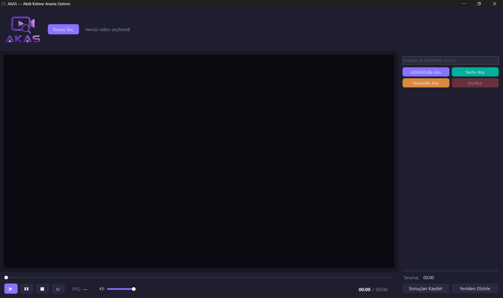

# AKAS — Akıllı Kelime Arama Sistemi 

Video içinde arama yapan Windows uygulaması. Bir video seçin, bir kelime yazın:

- **Görüntüde Ara** — ekranda görünen yazıları (altyazı, haber bandı, sunum metni…) OCR ile tarar,
- **Seste Ara** — konuşmaları yapay zekâ ile yazıya döker ve içinde arar,
- **Nesnede Ara** — karelerde görünen nesneleri (insan, araba, çanta, köpek… 80 sınıf) tanır ve arar.

Aranan şeyin geçtiği her an, bağlam bilgisiyle listelenir; sonuca tıklayınca video (sesiyle birlikte) o âna atlar ve kelime/nesne kare üzerinde kutu içine alınır.



## Özellikler

- **Hızlı görüntü taraması**: saniyede bir kare + değişmeyen kareleri atlama; kare zamanından hesaplanan doğru zaman damgaları
- **Akıllı eşleşme**: Türkçe kurallarına göre harf duyarsız arama (İ/ı dahil) ve OCR'ın 1-2 harf yanlış okuduğu kelimeleri de yakalayan bulanık eşleşme
- **Sesli arama**: [Whisper](https://github.com/ggerganov/whisper.cpp) ile tamamen çevrimdışı Türkçe konuşma tanıma (model ilk kullanımda uygulama içinden indirilir, ~466 MB)
- **Nesne araması**: [YOLOX](https://github.com/Megvii-BaseDetection/YOLOX) ile çevrimdışı nesne tespiti; 80 COCO sınıfı Türkçe adlarıyla aranır, sonuçlar "2 insan, 1 araba" biçiminde bağlam taşır (model depoya dahildir, ~4 MB)
- **Dizinleme**: her video bir kez taranır; sonuçlar video yanına `.ocr.json` / `.asr.json` olarak kaydedilir, sonraki aramalar anında biter. Video değişirse veya algoritma güncellenirse dizin otomatik yenilenir; "Yeniden Dizinle" ile elle de sıfırlanabilir
- **Senkron oynatıcı**: görüntü + ses birlikte; pürüzsüz oynatma saati, tıkla/sürükle-atla, ses düzeyi kontrolü
- **Klavye kısayolları**: `Boşluk` oynat/duraklat · `←`/`→` 5 saniye atlama · `Enter` arama
- Sonuçları `.txt` olarak dışa aktarma
- Koyu temalı, yeniden boyutlanabilir modern arayüz

## Kurulum

Gereksinimler: **Windows 10/11** ve **.NET 8 SDK** (veya çalıştırmak için .NET 8 Desktop Runtime).

```
git clone https://github.com/mustafaburaksanli/Video_Kelime_Arama.git
cd Video_Kelime_Arama
dotnet run --project VideoKelimeArama
```

Ya da `VideoKelimeArama.sln` dosyasını Visual Studio ile açıp F5.

- Türkçe OCR dil dosyası (`tessdata/tur.traineddata`) depoya dahildir; ek kurulum gerekmez.
- Whisper ses modeli (`whisper/ggml-small.bin`, ~466 MB) boyutu nedeniyle depoda **yoktur**; ilk "Seste Ara" denemesinde uygulama sorup kendisi indirir. Elle kurmak isterseniz [buradan](https://huggingface.co/ggerganov/whisper.cpp/resolve/main/ggml-small.bin) indirip uygulama klasöründeki `whisper/` içine koyun.

## Kullanım

1. **Dosya Seç** ile bir video açın (mp4/avi/mkv) — oynatma sesiyle birlikte başlar.
2. Arama kutusuna kelimeyi yazın; **Görüntüde Ara** veya **Seste Ara**'ya basın (Enter = Görüntüde Ara).
3. İlk arama videoyu tarar (görüntü: birkaç dakika; ses: model hızına göre daha uzun) ve eşleşmeler bulundukça listeye düşer. Aynı videodaki sonraki tüm aramalar dizinden anında gelir.
4. Listedeki bir sonuca tıklayın — video o âna atlar. **Sonuçları Kaydet** ile listeyi dosyaya alabilirsiniz.

## Teknoloji

| Bileşen | Kullanım |
|---|---|
| [Emgu.CV](https://www.emgu.com) (OpenCV) | Video kare okuma ve görüntü işleme |
| [Tesseract](https://github.com/charlesw/tesseract) | Ekran yazısı tanıma (OCR) |
| [Whisper.net](https://github.com/sandrohanea/whisper.net) (whisper.cpp) | Konuşma tanıma |
| [YOLOX](https://github.com/Megvii-BaseDetection/YOLOX) + [ONNX Runtime](https://onnxruntime.ai) | Nesne tespiti |
| [NAudio](https://github.com/naudio/NAudio) | Ses çalma ve videodan ses çıkarma |
| .NET 8 / Windows Forms | Arayüz |
